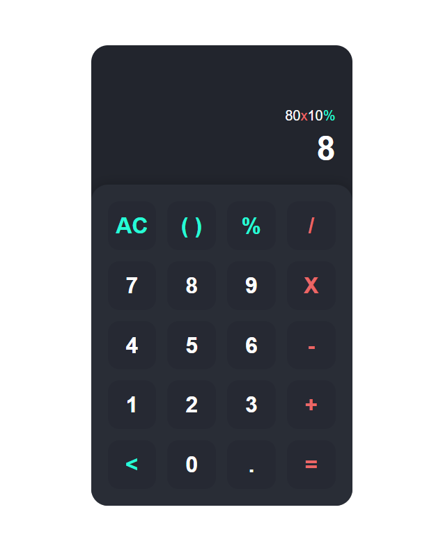

# simple-calculator
This is a calculator app built using HTML, CSS, and javaScript.

This was created for practice with sensitive edge cases and and flow control.

You can find the finished product <a href="https://psiko23.github.io/simple-calculator/">here</a>.

## Preview

